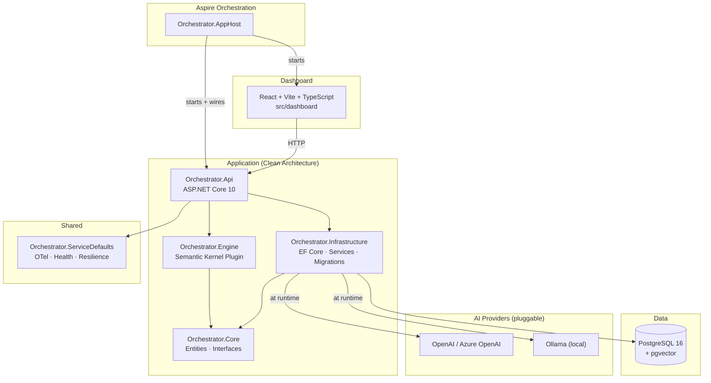
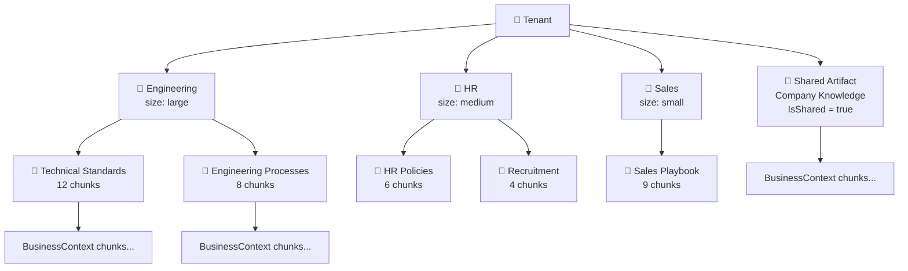
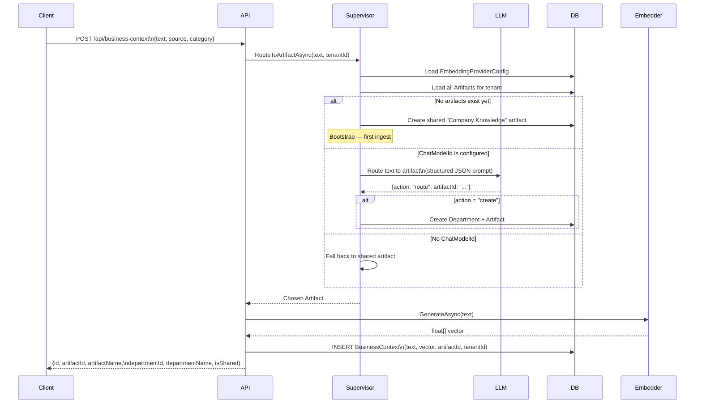
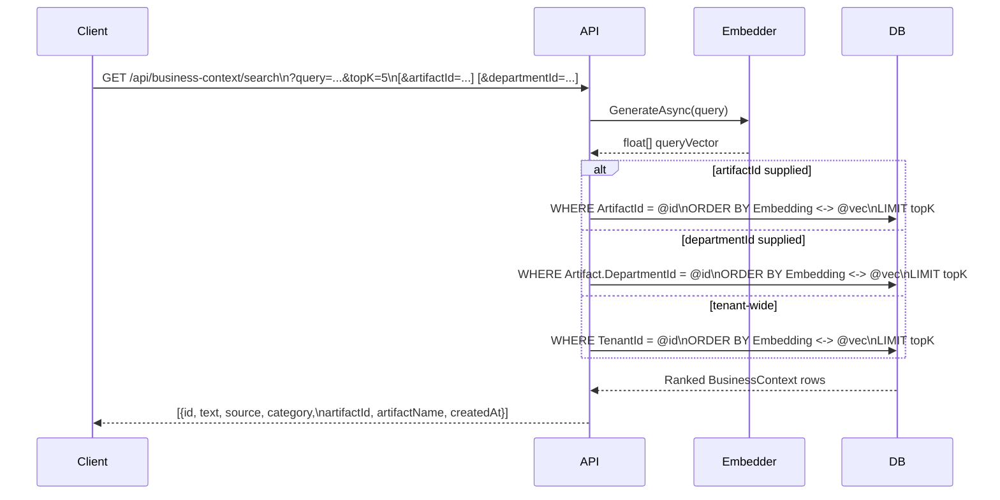
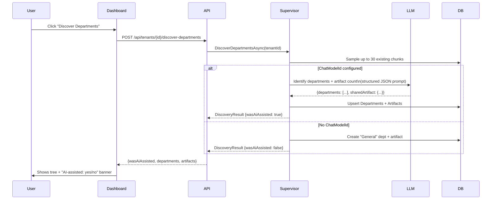
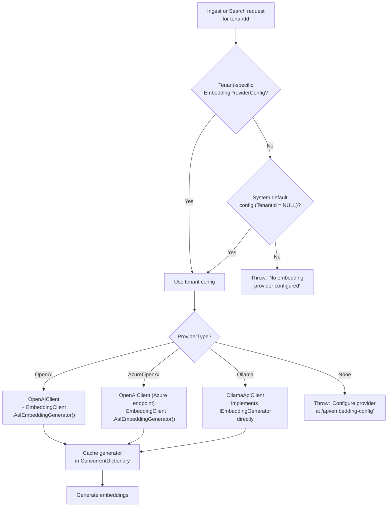

# Overview

## What this system is

The Business Intelligence Layer is a multi-tenant RAG (Retrieval-Augmented Generation) platform. Each organisation ("tenant") maintains its own private knowledge base — internal policies, strategy documents, operational rules, regulatory constraints. The platform converts that knowledge into vector embeddings, organises it into a structured hierarchy of departments and artifacts, and retrieves the most relevant context on demand using semantic search.

The system is **embedding-provider agnostic**: it works with OpenAI, Azure OpenAI, local Ollama models, or any compatible API. No specific vendor is required at startup — providers are configured through the API and stored per tenant.

An **AI supervisor** runs on every ingestion. Rather than dumping all knowledge into a single flat pool, the supervisor routes each piece of text to the correct *artifact* (a scoped knowledge document) within the right department, keeping the knowledge base organised automatically as it grows.

---

## Key concepts

| Concept | Description |
|---|---|
| **Tenant** | An organisation using the platform. All data is isolated by tenant ID. |
| **Department** | A division within a tenant (e.g. Engineering, HR, Sales). Discovered automatically by the AI or created manually. |
| **Artifact** | A scoped knowledge document within a department. A large department may have several artifacts; a small one has one. |
| **Shared Artifact** | One special artifact per tenant, not owned by any department — holds company-wide goals, mission, and cross-cutting policies. |
| **BusinessContext** | A single text chunk with its vector embedding. Always stored inside an artifact. |
| **Supervisor** | An LLM-powered routing agent. On each ingest it reads the text, looks at the tenant's artifact catalog, and decides where the new content belongs. |
| **EmbeddingProviderConfig** | Per-tenant (or system-wide default) configuration selecting which AI provider and model to use for both embeddings and the supervisor LLM. |

---

## System architecture

**Dependency direction:** `AppHost → Api → Engine → Core ← Infrastructure ← Api`

The `Core` project has zero external dependencies — no database drivers, no HTTP clients, no AI SDKs. Everything external lives in `Infrastructure`.

---

## Knowledge organisation

Knowledge within a tenant is structured as a three-level hierarchy:

- The **shared artifact** is always present and spans all departments. It captures mission, values, strategic goals, and anything that every department must work toward together.
- Departments are sized by the AI as **small** (1 artifact), **medium** (2 artifacts), or **large** (3 artifacts). A large Engineering department splits its knowledge into focused artifacts (standards vs. processes) so each artifact stays semantically coherent.
- Every `BusinessContext` chunk belongs to exactly one artifact, inheriting its department scope.

---

## Ingest flow

When text is submitted to `POST /api/business-context`, the supervisor runs first:

The response tells the caller exactly where the text was placed — which artifact and which department.

---

## Search flow

Search is always tenant-scoped. The optional `artifactId` or `departmentId` parameters narrow the scope further, which is useful for department-specific retrieval.

---

## Department discovery flow

Discovery is idempotent — running it again skips departments and artifacts whose names already exist.

---

## Provider resolution

The same provider config is used for both the **embedding model** (`ModelId`) and the **supervisor LLM** (`ChatModelId`). They share the same provider type, API key, and endpoint — only the model name differs.

---

## The two seeded companies

The demonstration data uses two competing broadband companies to show multi-tenant isolation clearly.

**FibreCore Networks** — the incumbent. 75 % market share, urban-first, premium-priced. Deliberate, committee-driven competitive response. Tenant ID: `a1a1a1a1-a1a1-a1a1-a1a1-a1a1a1a1a1a1`

**SwiftFibre** — the challenger. 25 % share and growing fast. At least 20 % below FibreCore on every plan, suburban and rural focus, 45-day build targets. Tenant ID: `b2b2b2b2-b2b2-b2b2-b2b2-b2b2b2b2b2b2`

Both tenants share the same database tables but are completely isolated: every query is filtered by `TenantId` before vector distance is computed. The integration tests explicitly verify that a search for tenant A returns nothing for tenant B.

---

## What works today

| Capability | Status |
|---|---|
| Multi-tenant knowledge ingestion with supervisor routing | ✅ Working |
| Vendor-agnostic embedding (OpenAI, Azure OpenAI, Ollama) | ✅ Working |
| Per-tenant and system-default provider config | ✅ Working |
| Department discovery (AI-assisted or fallback) | ✅ Working |
| Artifact management and chunk clearing | ✅ Working |
| Hybrid RAG search (tenant / artifact / department scoped) | ✅ Working |
| React dashboard (all pages, settings, knowledge tree) | ✅ Working |
| Guardrail middleware for `/api/generate/*` routes | ✅ Wired — no `/api/generate` controllers yet |
| Semantic Kernel plugin (`BusinessContextPlugin`) | ✅ Defined — not registered in DI yet |
| Authentication / tenant ownership verification | ❌ Not implemented — header is trusted as-is |
| Vector index (IVFFlat / HNSW) for scale | ❌ Not configured — sequential scans at large scale |
